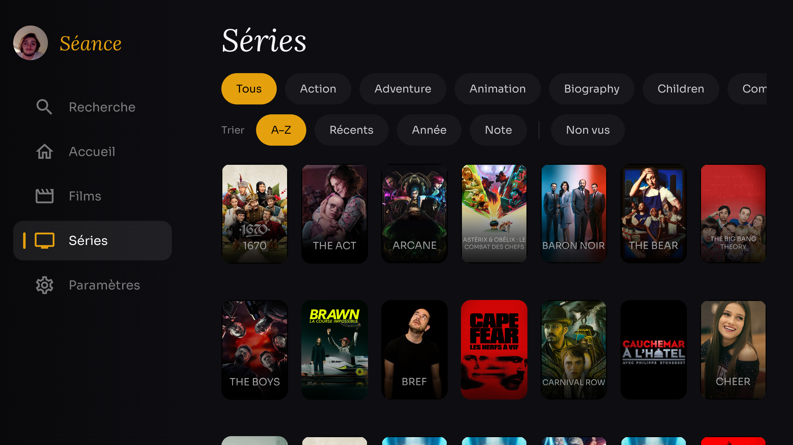
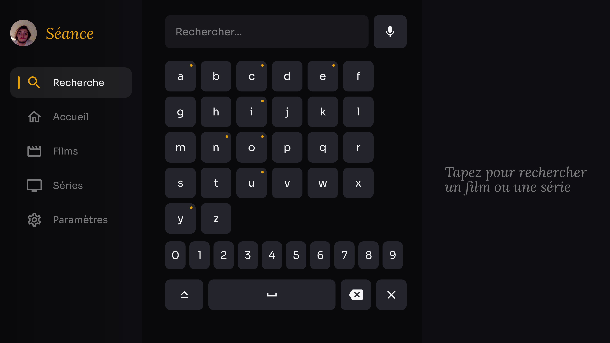
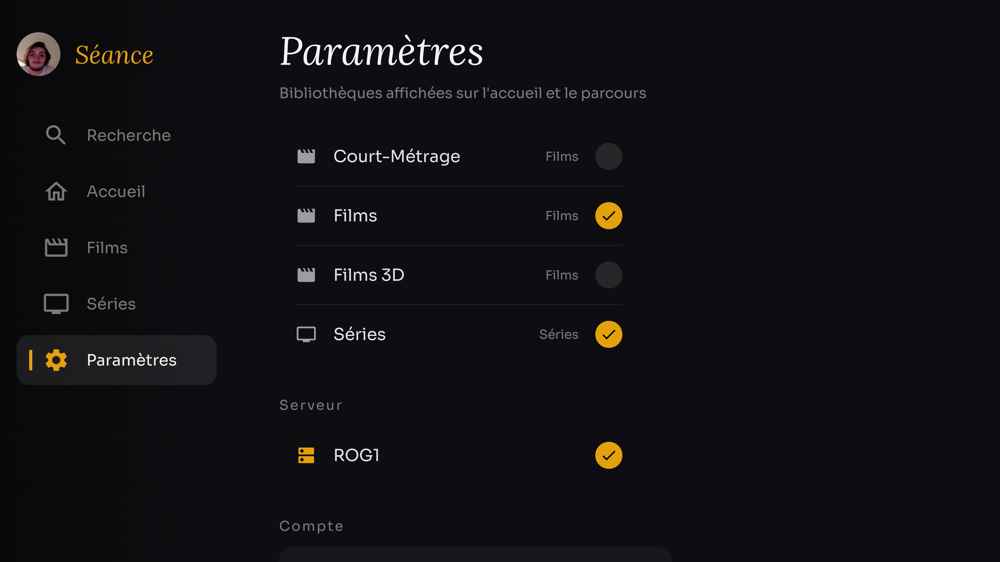

# Séance

A Netflix-grade **Android TV** client for [Plex](https://www.plex.tv/), built with Jetpack Compose for TV. Séance keeps a distinct identity (amber Plex accent, Lora serif titles) while delivering the polish you'd expect from a premium streaming UI.

## Screenshots

<table>
<tr>
<td width="50%"><br/><sub>Cinematic home — auto-rotating hero, focus-aware rows, dynamic accent</sub></td>
<td width="50%"><br/><sub>Browse grid — genre chips + sort (A–Z / recent / year / rating) + unwatched filter</sub></td>
</tr>
<tr>
<td width="50%"><br/><sub>TV keyboard — long-press accents, voice search, recent searches</sub></td>
<td width="50%"><br/><sub>Settings — library toggles, server switch, account; profile avatar in the rail</sub></td>
</tr>
</table>

## Features

- **Cinematic home** — a full-screen, auto-rotating hero that mixes *Continue Watching* and *Recently Added*, with title logos (Plex `clearLogo`) and a serif fallback.
- **Dynamic accent** — the UI accent color is extracted from the focused poster (Palette), so the interface adapts to whatever you're browsing.
- **Focus-aware rows** — the active row gently scales up and recenters on screen while the others dim, keeping your attention where the D-pad is.
- **Browse grid** — dedicated Movies / Shows pages with genre filter chips and paginated loading.
- **On-screen search** — a TV-friendly keyboard with live results across your libraries.
- **Rich detail pages** — backdrop, logo/tagline, full metadata, cast with photos, seasons & episodes (with stills, progress and summaries), a *More like this* row, and technical specs (resolution / video & audio codecs).
- **Library selection** — choose which Plex libraries appear on the home and browse screens (handy when you have several movie libraries).
- **Playback** — Media3 / ExoPlayer with resume support and progress reported back to the server, plus **audio & subtitle track selection** (picked from a *Tracks & subtitles* panel on the detail page, applied via ExoPlayer track selection). *(Interim MVP player — a libmpv-based player is planned, see Roadmap.)*

## Roadmap

### Player (interim ExoPlayer → planned libmpv rewrite)

The current player is a minimal MVP. It will be replaced by a **libmpv-based player** for broad codec support. Audio & subtitle track selection have since been wired into the ExoPlayer player; the rest below remains **deferred until that rewrite**:

- [x] **Subtitles** — track selection (Plex subtitle streams) chosen on the detail page, applied through ExoPlayer `TrackSelectionParameters`; rendered by ExoPlayer for embedded / Direct-Play tracks.
- [x] **Audio tracks** — multi-language selection (VF / VO) from the detail page's *Tracks & subtitles* panel.
- [ ] **Transcoding / fallback** — currently Direct Play only (`MediaItem.fromUri`); unsupported codecs show a black screen with no message. Needs a server transcode decision (`/video/:/transcode`).
- [ ] **Mark watched / unwatched** + correct progress state — progress is always reported as `state="playing"` (never `stopped`), so Plex never cleanly marks an item as finished.
- [ ] **Next episode / autoplay** — no PlayQueue; nothing happens at the end of an episode.
- [ ] **Skip intro / credits** — Plex `Marker` (intro/credits) chapters are not fetched.
- [ ] **Scrubbable timeline** — only ±10s seek today; no D-pad scrub to an arbitrary position.
- [ ] **Buffering indicator + playback error handling + retry**.
- [ ] **Material control icons** — replace emoji glyphs (`▶ ⏸ −10s`) with Material icons.

### UX / UI backlog (non-player)

- [x] **Multi-server selection** — Settings lists the account's Plex servers; switching persists the URL and restarts.
- [x] **Voice search** — mic button in search via Android TV `RecognizerIntent` (shown only when recognition is available).
- [x] **Recent searches** — persisted, shown as chips when the field is empty.
- [x] **Plex user profiles** ("who's watching") — Home users grid at startup, PIN entry for protected profiles, per-server access token, "switch profile" in Settings.
- [ ] **Remove from "Continue watching"** — needs a TV long-press context menu + Plex API.
- [ ] **Advanced Browse filters** — year, resolution (genre + sort + unwatched already done).
- [ ] **Shared-element transition** list → detail (fade is done).
- [ ] **Watchlist / My List** row + favorites.
- [ ] **Trailers & extras** (`includeExtras`).
- [ ] **Retry buttons + consistent skeleton loaders** on Browse / Detail / Settings.

## Tech stack

- **Kotlin** + **Jetpack Compose for TV** (`androidx.tv:tv-material`)
- **Hilt** for dependency injection
- **Navigation Compose** (single-Activity `NavHost` behind a TV navigation rail)
- **Retrofit** + **kotlinx.serialization** for the Plex API
- **Coil** for image loading, **AndroidX Palette** for dynamic colors
- **Media3 / ExoPlayer** for playback
- **DataStore** for auth token, server URL and user preferences

## Architecture

- **Auth** — Plex PIN flow (`plex.tv/link`); server discovery via the plex.tv resources endpoint. Token and the selected server URL are persisted in DataStore and injected through an OkHttp interceptor (`X-Plex-*` headers).
- **Data** — `PlexRepository` wraps the Plex HTTP API (library sections, on-deck, recently added, collections, `/all` browsing, genres, `hubs/search`, metadata with related hubs). `SettingsRepository` stores enabled libraries.
- **UI** — Compose screens (`home`, `browse`, `search`, `detail`, `settings`, `auth`) driven by `ViewModel` + `StateFlow`. Navigation is a single Activity hosting a `NavHost`; the full-screen player is a separate Activity.

```
app/src/main/java/com/seance/tv/
├── data/        # api, model, repository
├── di/          # Hilt modules, OkHttp interceptors, ServerManager
└── ui/          # auth, home, browse, search, detail, settings, player,
                 # components, navigation, theme
```

## Build & run

Requirements: **JDK 17**, Android SDK (compileSdk 34), an Android TV device or emulator (min SDK 23).

```bash
# Build the debug APK
./gradlew :app:assembleDebug        # Windows: .\gradlew.bat :app:assembleDebug

# Install & launch on a connected TV / emulator
adb install -r app/build/outputs/apk/debug/app-debug.apk
adb shell am start -n com.seance.tv/.MainActivity
```

On first launch, link the app from **plex.tv/link** using the displayed code; Séance then discovers your server automatically.

> Note: the project lives under a non-ASCII path (`E:\dev\séance`), so the AGP non-ASCII path check is disabled in Gradle properties.

## License

Personal project — not affiliated with Plex.
